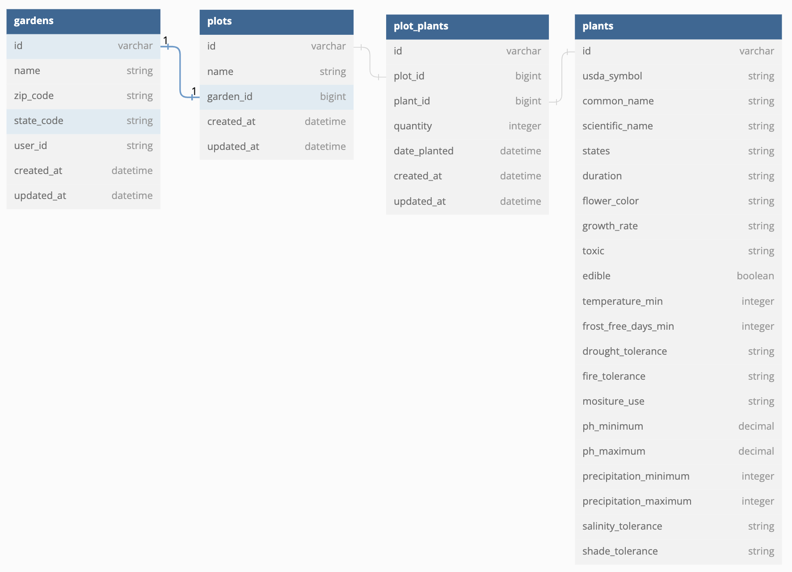

# Demeter-Be

## Turing Backend Engineering Group Project

  

#### Contributors: [Thomas Musselman](https://github.com/musselmanth) | [Riley McCullough](https://github.com/Rileybmcc) | [Sid Mann](https://github.com/sjmann2) | [A.J. Krumholz](https://github.com/ajkrumholz) | [Ken Lenhart](https://github.com/ajkrumholz)

---

## Description:

This is the back-end API for our Codename Demeter project. For for detailed information about the project please visit the front-end repository linked below.

This app includes a PostgreSQL database that stores garden, plot, and plant information for the app. Plant information is provided from CSV files of data scraped from the USDA's Plants Database. Plants were filtered so only plants with significant data are included.

The app also consumes two external APIs and consolidates the data to be consumed by our front end:

- Weather information for a user's garden is provided by consuming the [NOAA Weather API](https://www.noaa.gov/)
- USDA Plant Hardiness Zones are provided by https://phzmapi.org/ which is an API provided by Oregon State PRISM Climate Group

---

## Links

[Front End Repository](https://github.com/demeter-project/demeter-fe)

[Application Deployed on Heroku](https://en-root.herokuapp.com/)

---

## Technology Used

- Rails 5.2.6
- Ruby 2.7.4
- PostgreSQL Database
- CircleCI for CI/CD
- Heroku
- [jsonapi-serializer](https://github.com/jsonapi-serializer/jsonapi-serializer#conditional-relationships) for API response serialization.

---

## Local Setup Directions

[GitHub Repo](https://github.com/demeter-project/demeter-be)

```
git clone git@github.com:demeter-project/demeter-be.git

bundle install

rails db:{drop,create,migrate,seed}

rails s
```

---

## Database Schema Diagram



---

## Endpoints Available

### **Base URL**

`https://demeter-be.herokuapp.com/api/v1/`

---

### **Get one plant**

GET `/plants/<plant_id>`

**Example Response:**

```JSON
{
  "data": {
    "id": "192",
    "type": "plant",
    "attributes": {
      "common_name": "Heartleaf Arnica",
      "usda_symbol": "ARCO9",
      "scientific_name": "Arnica cordifolia",
      "states": "AK, AZ, CA, CO, ID, MI, MT, ND, NM, NV, OR, SD, UT, WA, WY",
      "duration": "Perennial",
      **etc...**
    }
  }
}
```

---

### **Get plants native to a particular state.**

GET `/plants`

**Required Params:**

- state_code: Two letter state code
- zip_code: 5-digit zip code for the planting location

**Optional Params:**

- search_name: A string search query which returns only results with a similar or matching name. If no matching results, a null data value will be returned.
- sort_by: Pass a plant attribute to sort the results based on that attribute. Available Options are any attribute listed in the plants table within the database schema above.
  **Example Queries:**

- GET `https://demeter-be.herokuapp.com/api/v1/plants?state_code=CO&zip_code=80223`
- GET `https://demeter-be.herokuapp.com/api/v1/plants?state_code=CO&zip_code=80223&sort_by=ph_minimum`
- GET `https://demeter-be.herokuapp.com/api/v1/plants?state_code=CO&zip_code=80223&seach_name=columbine`

**Example Response:**

```JSON
{
    "data": [
        {
            "id": "156",
            "type": "plant",
            "attributes": {
                "common_name": "Heartleaf Arnica",
                "usda_symbol": "ARCO9",
                "scientific_name": "Arnica cordifolia",
                "states": "AK, AZ, CA, CO, ID, MI, MT, ND, NM, NV, OR, SD, UT, WA, WY",
                "duration": "Perennial",
                "suitable_for_hz": true,
                **etc....**
            }
        },
        {
            "id": "124",
            "type": "plant",
            "attributes": {
                "common_name": "Heartleaf Arnica",
                "usda_symbol": "ARCO9",
                "scientific_name": "Arnica cordifolia",
                "states": "AK, AZ, CA, CO, ID, MI, MT, ND, NM, NV, OR, SD, UT, WA, WY",
                "duration": "Perennial",
                "suitable_for_hz": false,
                **etc....**
            }
        },
        **etc...**
    ]
}
```

**Notes**

Plants returned in this query include an additional boolean attribute "suitable_for_hz" that specifies whether the plant is suitable in the provided zip_code.

See the database schema above for list of other attributes on a given plant.

---

### **Get a user's gardens**

- GET `/gardens`

**Required Params:**

- user_id: The user's id.

**Example Query:**

- GET `https://demeter-be.herokuapp.com/api/v1/gardens?user_id=18`

**Example Response:**

```JSON
{
    "data": [
        {
            "id": "1",
            "type": "garden",
            "attributes": {
                "name": "My Garden",
                "zip_code": 80023,
                "state_code": "CO",
                "user_id": "18"
            }
        },
        {
            "id": "2",
            "type": "garden",
            "attributes": {
                "name": "My Second Garden",
                "zip_code": 80023,
                "state_code": "CO",
                "user_id": "18"
            }
        }
    ]
}
```

---

### **Get one garden**

GET `/gardens/<garden_id>`

**Example Response:**

```JSON
{
  "data": {
    "id": "6",
    "type": "garden",
    "attributes": {
      "name": "My Garden",
      "zip_code": 80023,
      "state_code": "CO",
      "weather_forecast": [
          {
              "id": 1,
              "day":"Tonight",
              "start_time": "2022-11-01T19:00:00-05:00",
              "end_time": "2022-11-02T06:00:00-05:00",
              "day_time": false,
              "temperature": 54,
              "temperature_unit": "F",
              "temperature_trend": null,
              "wind_speed": "15 mph",
              "wind_direction": "S",
              "icon": "https://api.weather.gov/icons/land/night/skc?size=medium",
              "short_forecast": "Clear",
              "detailed_forecast": "Clear, with a low around 54. South wind around 15 mph, with gusts as high as 25 mph."
          },
          {
              "id": 2,
              "day": "Wednesday",
              "start_time": "2022-11-02T06:00:00-05:00",
              "end_time": "2022-11-02T18:00:00-05:00",
              "daytime": true,
              "temperature": 76,
              "temperature_unit": "F",
              "temperature_trend": null,
              "wind_speed": "15 to 25 mph",
              "wind_direction": "S",
              "icon": "https://api.weather.gov/icons/land/day/wind_few?size=medium",
              "short_forecast": "Sunny",
              "detailed_forecast": "Sunny, with a high near 76. South wind 15 to 25 mph, with gusts as high as 40 mph."
        },
        **etc...(includes 7 days in actual response)**
      ]
    }
  }
}
```

**Notes:**

When fetching a single garden, the seven day forecast for garden's location is included in the attributes of the garden.

---

### **Get a garden's plots**

GET `/gardens/<garden_id>/plots`

**Example Response:**

```JSON
{
  "data": [
    {
      "id": "1",
      "type": "plot",
      "attributes": {
        "name": "Pink Flowers"
      }
    },
    {
      "id": "2",
      "type": "plot",
      "attributes": {
        "name": "Ornamental Grasses"
      }
    },
    **etc..**
  ]
}
```

---

### **Get one plot**

GET `/gardens/<garden_id>/plots/<plot_id>`

**Example Response**

```JSON
{
  "data": {
    "id": "15",
    "type": "plot",
    "attributes": {
      "name": "Succulents",
      "soil_ph_min": 5.7,
      "soil_ph_max": 7,
      "shade_tolerant?": true,
      "contains_toxic?": true
    }
  }
}
```

**Notes**

`soil_ph_min`, `soil_ph_max`, and `shade_tolerant` are calculated based on the plants within the plot. If there are currently no plants within the plot these values will be null.

---

### **Get a plot's plants**

GET `/gardens/<garden_id>/plots/<plot_id>/plot_plants`

**Example Response**

```JSON
{
  "data": [
    {
      "id": "3",
      "type": "plot_plant",
      "attributes": {
        "plant_id": "15",
        "plant_name": "Common Clover",
        "quantity": 5,
        "date_planted": "2022-05-18"
      }
    },
    {
      "id": "4",
      "type": "plot_plant",
      "attributes": {
        "plant_id": "185",
        "plant_name": "Columbine",
        "quantity": null,
        "date_planted": null
      }
    },
    **etc...**
  ]
}
```

**Notes:**

If a plant has null values for `quantity` and `date_planted` then it has been added to a garden but not planted.

---

### **Create a new garden**

POST `/gardens`

**Example Post Request JSON Body:**

```JSON
{
  "name": "My Garden",
  "zip_code": "80023",
  "state_code": "CO",
  "user_id": 15
}
```

**Example Response**

Response should match a GET `gardens/<garden_id>` response for the newly created garden.

---

### **Create a new plot for a garden**

POST `/gardens/<garden_id>/plots`

**Example Post Request JSON Body:**

```JSON
{
  "name": "Colorado Wildflowers"
}
```

**Example Response**

Response should match a GET `/gardens/<garden_id>/plots/<plot_id>` response for the newly created plot.

---

### **Delete a garden**

DELETE `/gardens/<garden_id>`

**Notes:**

Will return status 204 with no JSON response if the garden was successfully deleted.

---

### **Delete a plot in a garden**

DELETE `/gardens/<garden_id>/plots/<plot_id>`

**Notes:**

Will return status 204 with no JSON response if the plot was successfully deleted.

---

### **Delete a plant from a plot**

DELETE `/gardens/<garden_id>/plots/<plot_id>/plot_plants/<plot_plant_id>`

**Notes:**

Will return status 204 with no JSON response if the plot_plant was successfully deleted.

---

### **Add plants to existing plot / update plot**

PATCH `/gardens/<garden_id>/plots/<plot_id>`

**Example Patch Request JSON Body:**

```JSON
{
  "plant_ids": [8, 148, 298, 1024, 9]
}
```

**Example Response**

The response should match a GET `/gardens/<garden_id>/plots/<plot_id>` request response. The response will not include the added plants, however once the post request is made the plants can be retrieved with the GET `/gardens/<garden_id>/plots/<plot_id>/plot_plants` endpoint.

**Notes:**

The intention of this endpoint is to add plants to a plot, but it could also be passed a "name" in the JSON body to update the name.

---

### **Update a plot plant (plant the plant)**

PATCH `gardens/<garden_id>/plots/<plot_id>/plot_plants/<plot_plant_id>`

**Exampe Patch Request JSON Body:**

```JSON
{
  "date_planted": 2022-5-13,
  "quantity": 15
}
```

**Example Response**

```JSON
{
  "data": {
    "id": "15",
    "type": "plot_plant",
    "attributes": {
      "quantity": 15,
      "date_planted": 2022-5-15,
      "plant_id": 85,
      "plant_name": "Wild Thornbush"
    }
  }
}
```

**Notes:**

This endpoint is intended to be used to record the _planting_ of a plant in a garden after it has been added through the plant discover page.

---
